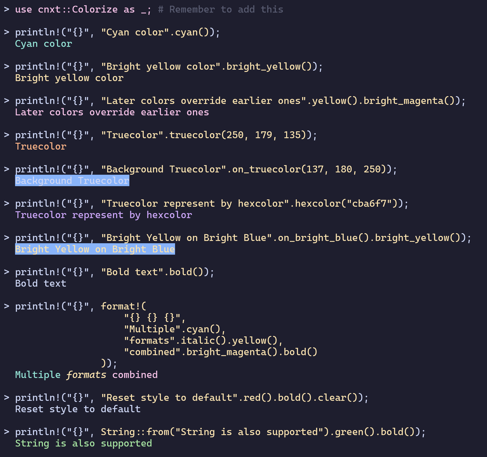
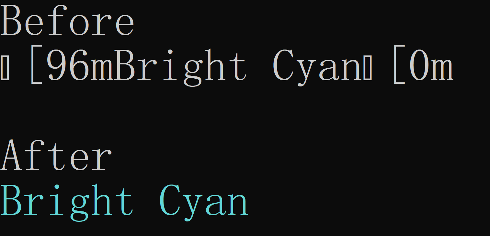

<div style="align: center;">
    
    <p>Run <code>cargo run --example banner -r</code> to print the Banner!</p>
</div>

# Colored Next (CNXT)

[](https://crates.io/crates/cnxt)

An enhanced fork of [colored](https://github.com/colored-rs/colored) offering superior performance and terminal
handling.

Why CNXT?

1. **Optimized Performance**: Utilizes `Cow` for intelligent memory
   management [(Inspired by this PR)](https://github.com/colored-rs/colored/pull/135)
2. **Modern Codebase**: Removed legacy code and streamlined implementation
3. **Advanced Terminal Support**: Sophisticated terminal capability detection with automatic color downgrading

## Usage

Coloring your terminal made simple. You already know how to do it.



### Essential Configuration

1. For **Windows targets**, add this to enable colors in **Windows CMD**:
    ```rust
    #[cfg(windows)]
    cnxt::control::set_virtual_terminal(true);
    ```

   Comparison showing how Windows CMD displays colors before and after enabling virtual terminal.

   

2. CNXT dynamically detects terminal color support across three tiers:
    - `Ansi16` (16 colors)
    - `Ansi256` (256 colors)
    - `TrueColor`

    When using colors beyond your terminal's capabilities, CNXT automatically **downgrades** them to the maximum
    supported level.

    Manual control options:
    ```rust
    use cnxt::control::{set_should_colorize, ShouldColorize};
    
    // Environment-based detection level (default)
    set_should_colorize(ShouldColorize::from_env());

    // Explicit configuration
    set_should_colorize(ShouldColorize::YesWithTrueColor);  // Force truecolor
    set_should_colorize(ShouldColorize::YesWithAnsi256);    // Force 256-color
    set_should_colorize(ShouldColorize::No);                // Disable colors
    set_should_colorize(ShouldColorize::Yes);               // Enable colors with auto-detect level

    // Manual color fallback
    use cnxt::Color;

    let truecolor = Color::TrueColor { r: 166, g: 227, b: 161 };
    let ansi16 = truecolor.fallback_to_ansi16();
    let ansi256 = truecolor.fallback_to_ansi256();
    ```

### Features
1. **terminal-detection** (Enabled by default): 

    Automatically detects terminal color support and downgrades colors accordingly.

    Defaultly use TrueColor if disable this feature.

2. **conditional-coloring** :
    Provide helper functions to colorize strings based on conditions.

    ```rust
    use cnxt::Colorize as _;
    
    println!("{}", "red".red_if(true)); // print red color
    println!("{}", "red".red_if(false)); // print no color

    println!("{}", "green".green().red_if(false)); // print green color
    ```

## License

CNXT maintains the original [MPL-2.0 License](https://www.mozilla.org/en-US/MPL/2.0/) from
the [colored](https://github.com/colored-rs/colored) project.
